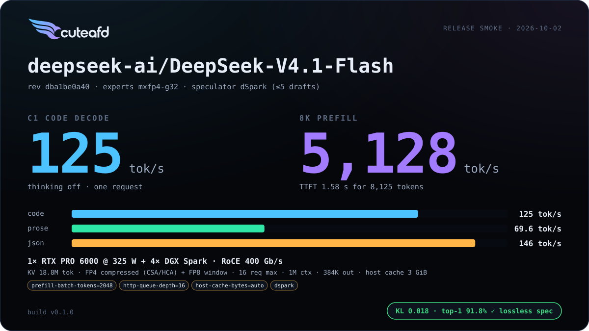
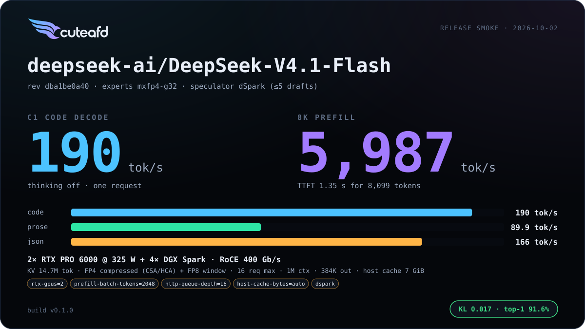
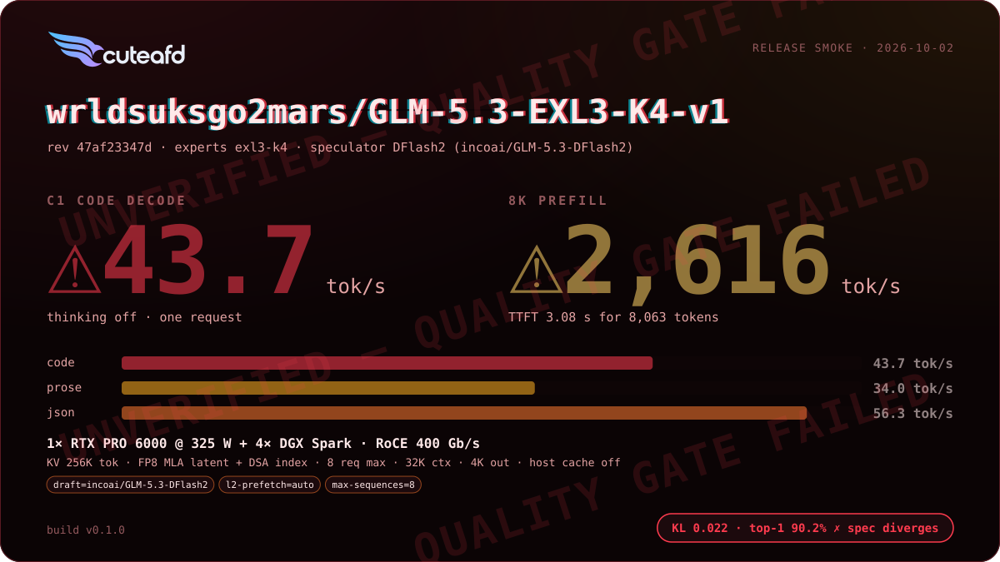
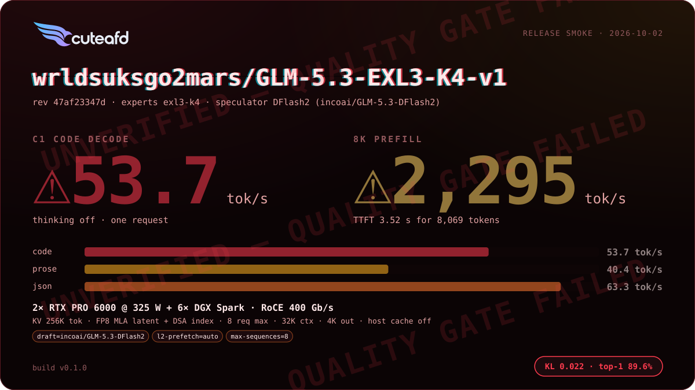
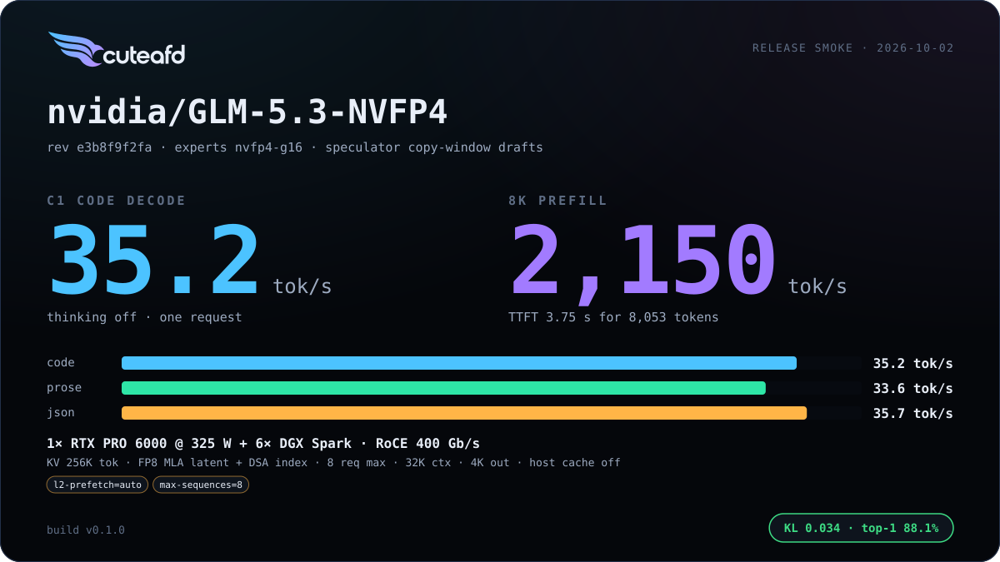
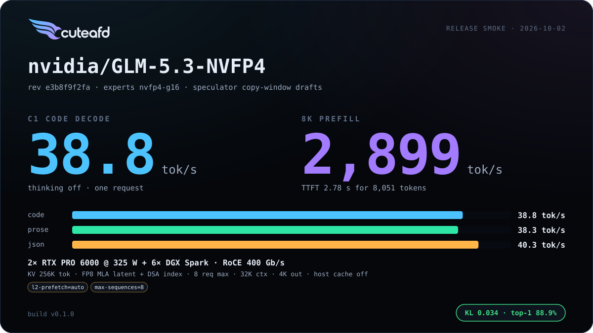
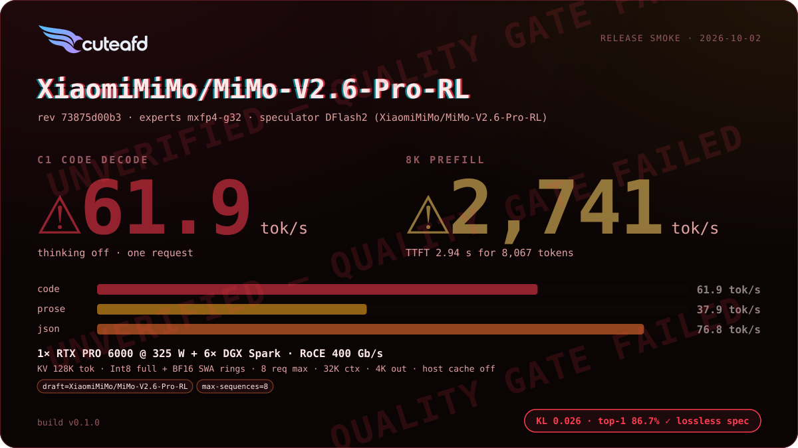
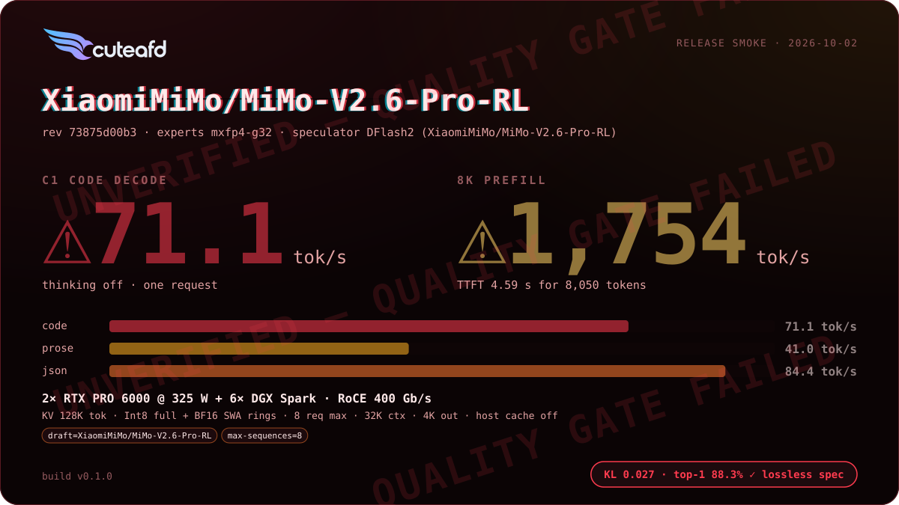

  <picture>
    <source media="(prefers-color-scheme: dark)" srcset="assets/brand/cuteafd-logo-color-dark.svg">
    
  </picture>

CuteAFD brings frontier-scale open-weights models into the home lab at
data-center speed. It disaggregates attention from the routed experts: one or
two consumer-Blackwell RTX PRO 6000 cards run attention, the dense
backbone, routing and sampling, while a pool of DGX Sparks (GB10, SM121) holds
the routed experts and answers over RoCE. The same engine loads a model's
standard Hugging Face checkpoint directly — no side files, no repacking — and
runs it on the formats it actually ships in: official FP8 and MXFP4,
NVIDIA ModelOpt NVFP4, and EXL3, with native kernels that honor each
checkpoint's own numerics instead of converting everything to one internal
format.

- Attention/FFN disaggregation (AFD): RTX cards own the backbone, Sparks own
  the experts, exchanging activations over RoCE with GPU-direct landing.
- Robust quant support: official FP8/MXFP4, NVIDIA ModelOpt NVFP4, and EXL3,
  loaded from the checkpoint's own `config.json` and tensor headers.
- Exact prefix caching for agentic work: the deepest cached snapshot that
  prefixes a request is restored byte-identical, not approximated.
- Own your intelligence: your weights, your hardware, your rate limits (none),
  agentic coding at full speed on a machine you control, not a shared tenant.

## Models

Basic benchmark profile per family on its natural-minimum (1× RTX + fewest
Sparks) and maximum (2× RTX + 4 or 6 Sparks) hardware. Other reports:
[`benchmarks/`](benchmarks/README.md).

<!-- results:begin -->
<table>
<tr><th>Model · quant</th><th>Minimum hardware</th><th>Maximum hardware</th></tr>
<tr>
<td width="20%" valign="top"><a href="docs/models/deepseek_v41.md"><b>DeepSeek V4.1</b></a> deepseek-ai/DeepSeek-V4.1-Flash mxfp4-g32</td>
<td width="40%" valign="top"> 1× RTX + 4× Spark</td>
<td width="40%" valign="top"> 2× RTX + 4× Spark</td>
</tr>
<tr>
<td width="20%" valign="top"><a href="docs/models/deepseek_v4.md"><b>DeepSeek V4</b></a> deepseek-ai/DeepSeek-V4-Flash-0731 mxfp4-g32</td>
<td width="40%" valign="top"> 1× RTX + 4× Spark</td>
<td width="40%" valign="top"> 2× RTX + 4× Spark</td>
</tr>
<tr>
<td width="20%" valign="top"><a href="docs/models/deepseek_v4.md"><b>DeepSeek V4</b></a> wrldsuksgo2mars/DeepSeek-V4-Pro-0813-EXL3-K2-calibrated-v1 exl3-k2</td>
<td width="40%" valign="top"> 1× RTX + 4× Spark</td>
<td width="40%" valign="top"> 2× RTX + 6× Spark</td>
</tr>
<tr>
<td width="20%" valign="top"><a href="docs/models/glm5.md"><b>GLM 5.3</b></a> wrldsuksgo2mars/GLM-5.3-EXL3-K4-v1 exl3-k4</td>
<td width="40%" valign="top"> 1× RTX + 4× Spark</td>
<td width="40%" valign="top"> 2× RTX + 6× Spark</td>
</tr>
<tr>
<td width="20%" valign="top"><a href="docs/models/glm5.md"><b>GLM 5.3</b></a> nvidia/GLM-5.3-NVFP4 nvfp4-g16</td>
<td width="40%" valign="top"> 1× RTX + 6× Spark</td>
<td width="40%" valign="top"> 2× RTX + 6× Spark</td>
</tr>
<tr>
<td width="20%" valign="top"><a href="docs/models/glm5_flash.md"><b>GLM 5.3 Flash</b></a> wrldsuksgo2mars/GLM-5.3-Flash-EXL3-K3.25-v1 exl3-k3+exl3-k4</td>
<td width="40%" valign="top"> 1× RTX + 2× Spark</td>
<td width="40%" valign="top"> 1× RTX + 4× Spark</td>
</tr>
<tr>
<td width="20%" valign="top"><a href="docs/models/glm5_flash.md"><b>GLM 5.3 Flash</b></a> nvidia/GLM-5.3-Flash-NVFP4 nvfp4-g16</td>
<td width="40%" valign="top"> 1× RTX + 4× Spark</td>
<td width="40%" align="center">—</td>
</tr>
<tr>
<td width="20%" valign="top"><a href="docs/models/glm5_flash.md"><b>GLM 5.3 Flash</b></a> brandonmusic/GLM-5.3-Flash-tr3-4bpw exl3-k4</td>
<td width="40%" valign="top"> 1× RTX + 2× Spark</td>
<td width="40%" valign="top"> 1× RTX + 4× Spark</td>
</tr>
<tr>
<td width="20%" valign="top"><a href="docs/models/mimo_v2.md"><b>MiMo V2</b></a> XiaomiMiMo/MiMo-V2-Flash fp8-block128x128/f32</td>
<td width="40%" valign="top"> 1× RTX + 4× Spark</td>
<td width="40%" valign="top"> 2× RTX + 4× Spark</td>
</tr>
<tr>
<td width="20%" valign="top"><a href="docs/models/mimo_v2.md"><b>MiMo V2</b></a> XiaomiMiMo/MiMo-V2.6-Pro-RL mxfp4-g32</td>
<td width="40%" valign="top"> 1× RTX + 6× Spark</td>
<td width="40%" valign="top"> 2× RTX + 6× Spark</td>
</tr>
<tr>
<td width="20%" valign="top"><a href="docs/models/qwen4.md"><b>Qwen 3.8</b></a> wrldsuksgo2mars/Qwen3.8-Flash-Next-EXL3-K4.25-PLE-FP8-v1 exl3-k4+exl3-k5</td>
<td width="40%" valign="top"> 1× RTX</td>
<td width="40%" valign="top"> 1× RTX + 4× Spark</td>
</tr>
<tr>
<td width="20%" valign="top"><a href="docs/models/qwen4.md"><b>Qwen 3.8</b></a> nvidia/Qwen3.8-Flash-Next-NVFP4 nvfp4-g16</td>
<td width="40%" valign="top"> 1× RTX + 4× Spark</td>
<td width="40%" align="center">—</td>
</tr>
</table>

| Family | Checkpoint | Hardware | KV / req | C1 code | prose | JSON | 8K prefill | TTFT | Quality | Report |
| --- | --- | --- | --- | ---: | ---: | ---: | ---: | ---: | --- | --- |
| [DeepSeek V4.1](docs/models/deepseek_v41.md) | DeepSeek-V4.1-Flash (mxfp4-g32) | 1× RTX + 4× Spark (min) | 18.8M tok / 16 req | 125 | 69.6 | 146 | 5,128 | 1.58 s | ✓ KL 0.018 · top-1 91.8% ✓ lossless spec | [2026-10-02 · v0.1.0](benchmarks/deepseek_v41/2026-10-02-smoke-deepseek-v4-1-flash-1rtx-4spark/report.svg) |
| [DeepSeek V4.1](docs/models/deepseek_v41.md) | DeepSeek-V4.1-Flash (mxfp4-g32) | 2× RTX + 4× Spark (max) | 14.7M tok / 16 req | 190 | 89.9 | 166 | 5,987 | 1.35 s | ✓ KL 0.017 · top-1 91.6% | [2026-10-02 · v0.1.0](benchmarks/deepseek_v41/2026-10-02-smoke-deepseek-v4-1-flash-2rtx-4spark/report.svg) |
| [DeepSeek V4](docs/models/deepseek_v4.md) | DeepSeek-V4-Flash-0731 (mxfp4-g32) | 1× RTX + 4× Spark (min) | 258K tok / 8 req | 198 | 84.8 | 203 | 4,484 | 1.81 s | ✓ KL 0.010 · top-1 92.8% ✓ lossless spec | [2026-10-02 · v0.1.0](benchmarks/deepseek_v4/2026-10-02-smoke-deepseek-v4-flash-0731-1rtx-4spark/report.svg) |
| [DeepSeek V4](docs/models/deepseek_v4.md) | DeepSeek-V4-Flash-0731 (mxfp4-g32) | 2× RTX + 4× Spark (max) | 258K tok / 8 req | 203 | 94.9 | 209 | 5,133 | 1.57 s | ✓ KL 0.014 · top-1 92.2% ✓ lossless spec | [2026-10-02 · v0.1.0](benchmarks/deepseek_v4/2026-10-02-smoke-deepseek-v4-flash-0731-2rtx-4spark/report.svg) |
| [DeepSeek V4](docs/models/deepseek_v4.md) | DeepSeek-V4-Pro-0813-EXL3-K2-calibrated-v1 (exl3-k2) | 1× RTX + 4× Spark (min) | 258K tok / 8 req | 75.7 | 34.4 | 79.9 | 879 | 9.23 s | ⚠ **FAILED** failed: Speculation lossless | [2026-10-02 · v0.1.0](benchmarks/deepseek_v4/2026-10-02-smoke-deepseek-v4-pro-0813-exl3-k2-calibrated-v1-1rtx-4spark/report.svg) |
| [DeepSeek V4](docs/models/deepseek_v4.md) | DeepSeek-V4-Pro-0813-EXL3-K2-calibrated-v1 (exl3-k2) | 2× RTX + 6× Spark (max) | 258K tok / 8 req | 90.8 | 42.0 | 96.6 | 2,438 | 3.32 s | ⚠ **FAILED** failed: Speculation lossless | [2026-10-02 · v0.1.0](benchmarks/deepseek_v4/2026-10-02-smoke-deepseek-v4-pro-0813-exl3-k2-calibrated-v1-2rtx-6spark/report.svg) |
| [GLM 5.3](docs/models/glm5.md) | GLM-5.3-EXL3-K4-v1 (exl3-k4) | 1× RTX + 4× Spark (min) | 256K tok / 8 req | 43.7 | 34.0 | 56.3 | 2,616 | 3.08 s | ⚠ **FAILED** failed: Speculation lossless, Template round trip, C1 vs C4 divergence | [2026-10-02 · v0.1.0](benchmarks/glm5/2026-10-02-smoke-glm-5-3-exl3-k4-v1-1rtx-4spark/report.svg) |
| [GLM 5.3](docs/models/glm5.md) | GLM-5.3-EXL3-K4-v1 (exl3-k4) | 2× RTX + 6× Spark (max) | 256K tok / 8 req | 53.7 | 40.4 | 63.3 | 2,295 | 3.52 s | ⚠ **FAILED** failed: Template round trip, C1 vs C4 divergence | [2026-10-02 · v0.1.0](benchmarks/glm5/2026-10-02-smoke-glm-5-3-exl3-k4-v1-2rtx-6spark/report.svg) |
| [GLM 5.3](docs/models/glm5.md) | GLM-5.3-NVFP4 (nvfp4-g16) | 1× RTX + 6× Spark (min) | 256K tok / 8 req | 35.2 | 33.6 | 35.7 | 2,150 | 3.75 s | ✓ KL 0.034 · top-1 88.1% | [2026-10-02 · v0.1.0](benchmarks/glm5/2026-10-02-smoke-glm-5-3-nvfp4-1rtx-6spark/report.svg) |
| [GLM 5.3](docs/models/glm5.md) | GLM-5.3-NVFP4 (nvfp4-g16) | 2× RTX + 6× Spark (max) | 256K tok / 8 req | 38.8 | 38.3 | 40.3 | 2,899 | 2.78 s | ✓ KL 0.034 · top-1 88.9% | [2026-10-02 · v0.1.0](benchmarks/glm5/2026-10-02-smoke-glm-5-3-nvfp4-2rtx-6spark/report.svg) |
| [GLM 5.3 Flash](docs/models/glm5_flash.md) | GLM-5.3-Flash-EXL3-K3.25-v1 (exl3-k3+exl3-k4) | 1× RTX + 2× Spark (min) | 64K tok / 8 req | 82.6 | 66.7 | 97.9 | 3,198 | 2.52 s | ✓ KL 0.046 · top-1 89.1% ✓ lossless spec | [2026-10-02 · v0.1.0](benchmarks/glm5_flash/2026-10-02-smoke-glm-5-3-flash-exl3-k3-25-v1-1rtx-2spark/report.svg) |
| [GLM 5.3 Flash](docs/models/glm5_flash.md) | GLM-5.3-Flash-EXL3-K3.25-v1 (exl3-k3+exl3-k4) | 1× RTX + 4× Spark (max) | 64K tok / 8 req | 117 | 84.6 | 156 | 2,818 | 2.86 s | ⚠ **FAILED** failed: Template round trip | [2026-10-02 · v0.1.0](benchmarks/glm5_flash/2026-10-02-smoke-glm-5-3-flash-exl3-k3-25-v1-1rtx-4spark/report.svg) |
| [GLM 5.3 Flash](docs/models/glm5_flash.md) | GLM-5.3-Flash-NVFP4 (nvfp4-g16) | 1× RTX + 4× Spark (min) | 64K tok / 8 req | 73.6 | 73.3 | 82.5 | 5,865 | 1.37 s | ✓ KL 0.039 · top-1 87.9% ✓ lossless spec | [2026-10-02 · v0.1.0](benchmarks/glm5_flash/2026-10-02-smoke-glm-5-3-flash-nvfp4-1rtx-4spark/report.svg) |
| [GLM 5.3 Flash](docs/models/glm5_flash.md) | GLM-5.3-Flash-tr3-4bpw (exl3-k4) | 1× RTX + 2× Spark (min) | 64K tok / 8 req | 76.2 | 61.4 | 77.5 | 1,409 | 5.72 s | ⚠ **FAILED** failed: Template round trip | [2026-10-02 · v0.1.0](benchmarks/glm5_flash/2026-10-02-smoke-glm-5-3-flash-tr3-4bpw-1rtx-2spark/report.svg) |
| [GLM 5.3 Flash](docs/models/glm5_flash.md) | GLM-5.3-Flash-tr3-4bpw (exl3-k4) | 1× RTX + 4× Spark (max) | 64K tok / 8 req | 95.9 | 90.8 | 148 | 2,889 | 2.79 s | ⚠ **FAILED** failed: Speculation lossless, Template round trip | [2026-10-02 · v0.1.0](benchmarks/glm5_flash/2026-10-02-smoke-glm-5-3-flash-tr3-4bpw-1rtx-4spark/report.svg) |
| [MiMo V2](docs/models/mimo_v2.md) | MiMo-V2-Flash (fp8-block128x128/f32) | 1× RTX + 4× Spark (min) | 128K tok / 8 req | 70.9 | 58.6 | 75.0 | 5,877 | 1.37 s | ✓ KL 0.103 · top-1 82.6% ✓ lossless spec | [2026-10-02 · v0.1.0](benchmarks/mimo_v2/2026-10-02-smoke-mimo-v2-flash-1rtx-4spark/report.svg) |
| [MiMo V2](docs/models/mimo_v2.md) | MiMo-V2-Flash (fp8-block128x128/f32) | 2× RTX + 4× Spark (max) | 128K tok / 8 req | 74.2 | 60.2 | 89.0 | 2,899 | 2.78 s | ✓ KL 0.105 · top-1 81.8% ✓ lossless spec | [2026-10-02 · v0.1.0](benchmarks/mimo_v2/2026-10-02-smoke-mimo-v2-flash-2rtx-4spark/report.svg) |
| [MiMo V2](docs/models/mimo_v2.md) | MiMo-V2.6-Pro-RL (mxfp4-g32) | 1× RTX + 6× Spark (min) | 128K tok / 8 req | 61.9 | 37.9 | 76.8 | 2,741 | 2.94 s | ⚠ **FAILED** failed: Template round trip | [2026-10-02 · v0.1.0](benchmarks/mimo_v2/2026-10-02-smoke-mimo-v2-6-pro-rl-1rtx-6spark/report.svg) |
| [MiMo V2](docs/models/mimo_v2.md) | MiMo-V2.6-Pro-RL (mxfp4-g32) | 2× RTX + 6× Spark (max) | 128K tok / 8 req | 71.1 | 41.0 | 84.4 | 1,754 | 4.59 s | ⚠ **FAILED** failed: Template round trip | [2026-10-02 · v0.1.0](benchmarks/mimo_v2/2026-10-02-smoke-mimo-v2-6-pro-rl-2rtx-6spark/report.svg) |
| [Qwen 3.8](docs/models/qwen4.md) | Qwen3.8-Flash-Next-EXL3-K4.25-PLE-FP8-v1 (exl3-k4+exl3-k5) | 1× RTX (min) | 32K tok / 8 req | 261 | 168 | 291 | 6,694 | 1.19 s | ✓ KL 0.034 · top-1 88.5% ✓ lossless spec | [2026-10-02 · v0.1.0](benchmarks/qwen4/2026-10-02-smoke-qwen3-8-flash-next-exl3-k4-25-ple-fp8-v1-1rtx/report.svg) |
| [Qwen 3.8](docs/models/qwen4.md) | Qwen3.8-Flash-Next-EXL3-K4.25-PLE-FP8-v1 (exl3-k4+exl3-k5) | 1× RTX + 4× Spark (max) | 32K tok / 8 req | 84.4 | 84.4 | 89.5 | 4,200 | 1.90 s | ✓ KL 0.032 · top-1 88.7% ✓ lossless spec | [2026-10-02 · v0.1.0](benchmarks/qwen4/2026-10-02-smoke-qwen3-8-flash-next-exl3-k4-25-ple-fp8-v1-1rtx-4spark/report.svg) |
| [Qwen 3.8](docs/models/qwen4.md) | Qwen3.8-Flash-Next-NVFP4 (nvfp4-g16) | 1× RTX + 4× Spark (min) | 32K tok / 8 req | 81.8 | 79.3 | 87.4 | 3,590 | 2.21 s | ✓ KL 0.051 · top-1 86.1% ✓ lossless spec | [2026-10-02 · v0.1.0](benchmarks/qwen4/2026-10-02-smoke-qwen3-8-flash-next-nvfp4-1rtx-4spark/report.svg) |

tok/s; C1 decode with thinking off, 8K prefill cold. Quality: logit fidelity against the family golden reference, prefix-cache restore exactness, lossless speculation.

<!-- results:end -->

Each family's page ([`docs/models/`](docs/models/)) has its supported
checkpoints and quants, engineering summary and known limits:
[DeepSeek V4.1 Flash](docs/models/deepseek_v41.md),
[DeepSeek V4 Flash/Pro](docs/models/deepseek_v4.md),
[GLM 5.3](docs/models/glm5.md), [GLM 5.3 Flash](docs/models/glm5_flash.md),
[MiMo V2 Flash / V2.6 Pro](docs/models/mimo_v2.md),
[Qwen 3.8 Flash Next](docs/models/qwen4.md).

## Storage

The checkpoints and quants behind these numbers were served from
[SparkNest](https://github.com/tpurtell/sparknest), a distributed model store
across the cluster: hosts that already hold a sealed local copy of a shard
read it at NVMe speed, hosts without one stream it over RoCE at roughly
5 GB/s. SparkNest is what made the quoted load times possible; it is a
separate project, not required to run CuteAFD, and any standard Hugging Face
cache layout works.

## Quick start

1. `cuteafd plan MODEL` (any Hugging Face model id or local snapshot
   directory) reports what the checkpoint needs — tensors, formats, shapes,
   and which kernels are missing — before you touch a GPU. Add `--layout
   --rtx 1|2 --pool-tokens 0` for per-device weights, cache admission,
   workspaces and Spark ranks. V4 Flash/Pro workspace formulas use the
   matching image manifest (`--workspace-manifest PROGRAMS.json`). The
   image also supplies EXL3 allocation manifests; when exporting metadata,
   keep their `exl3/` tree alongside `PROGRAMS.json`.
   Qwen local EXL3 K4.25 and V4.1 native TP4 layouts are calibrated on one
   RTX PRO 6000 after 8K prefill and C4; unmeasured layouts stay estimates.
2. Pick or adapt a config under [`examples/configs/`](examples/configs/) or
   edit `cuteafd.config` for your own topology (coordinator GPUs, Spark
   ranks, TP/EP layout). `POOL_TOKENS=auto` selects planner admission for
   V4, V4.1 and Qwen; the engine spelling is `--pool-tokens 0`. V4.1 keeps
   its existing pool policy when this option is omitted.
3. `./run.sh` launches the release images named in the config,
   `ghcr.io/tpurtell/cuteafd-coordinator:v0.1.0` on the RTX host and
   `ghcr.io/tpurtell/cuteafd-spark-expert:v0.1.0` on each Spark; `docker pull`
   them on those hosts first (`./run.sh` does not pull). `./wip.sh --slot S --role both`
   plus `./run.sh --wip S --restart` is the faster loop while iterating.

## Working on it

[`AGENTS.md`](AGENTS.md) is the standing guide for agents and collaborators
working on CuteAFD. [`PLAN.md`](PLAN.md) is the roadmap.
