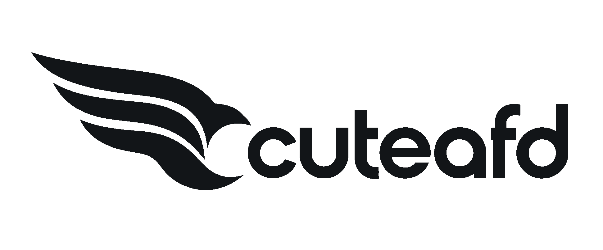

  <picture>
    <source media="(prefers-color-scheme: dark)" srcset="assets/brand/cuteafd-logo-light.svg">
    
  </picture>

An attention/FFN-disaggregated LLM engine for consumer Blackwell: attention on
one or two RTX cards (SM120), routed experts on a pool of DGX Sparks (SM121)
over RoCE. It loads standard Hugging Face checkpoints directly and serves an
OpenAI-compatible API with a live console.

Models: DeepSeek V4.1 Flash, DeepSeek V4 Flash / Pro, GLM 5.3, GLM 5.3 Flash,
MiMo V2 Flash, MiMo V2.6 Pro, Qwen 3.8 Flash Next.

## Results

Basic benchmark profile per family on its natural-minimum (1× RTX + fewest
Sparks) and maximum (2× RTX + 4 or 6 Sparks) hardware. Other reports:
[`benchmarks/`](benchmarks/README.md).

<!-- results:begin -->
_Pending the first published run._
<!-- results:end -->

## Working on it

[`AGENTS.md`](AGENTS.md) holds the standing rules, [`PLAN.md`](PLAN.md) the plan.
