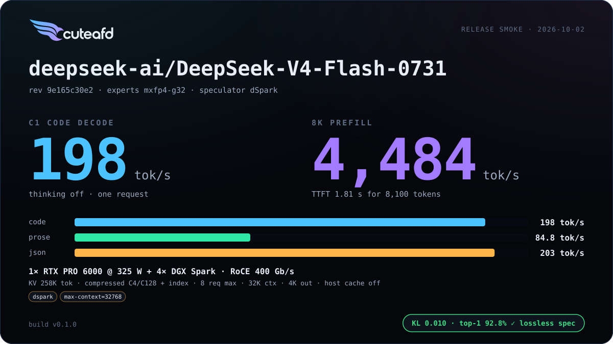
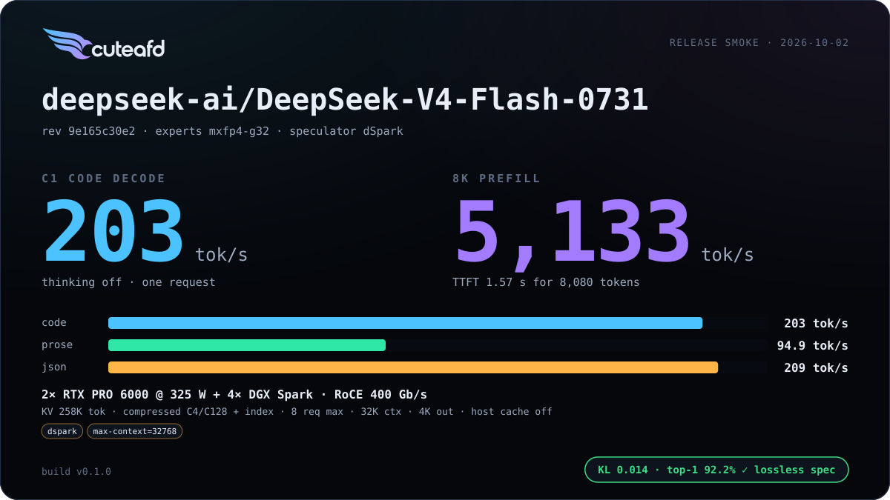
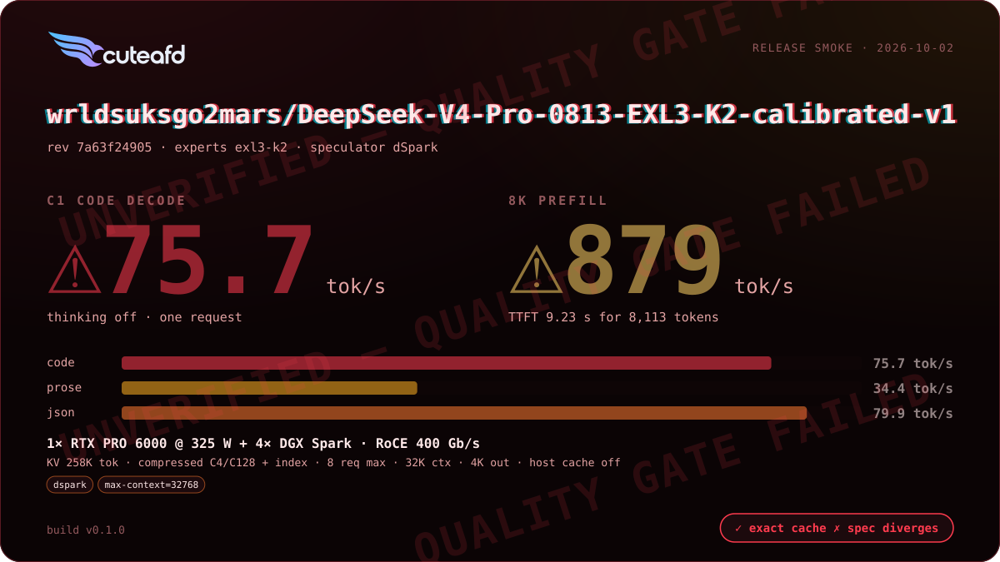
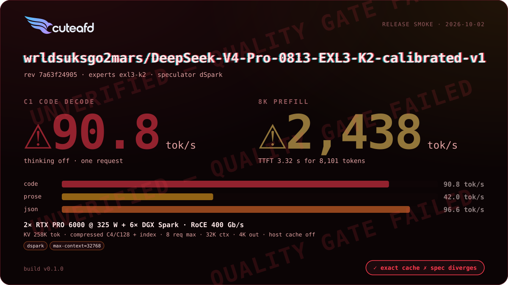

# DeepSeek V4 (Flash / Pro)

Re-hosted on CuteAFD's generic per-layer engine rather than the legacy
`real_full` path; DeepSeek V4.1 Flash remains the parity anchor it is
checked against.

## Supported checkpoints / quants

- `deepseek-ai/DeepSeek-V4-Flash-0731` — FP8 128x128-block coordinator
  weights, native MXFP4 routed experts.
- `wrldsuksgo2mars/DeepSeek-V4-Pro-0813-EXL3-K2-calibrated-v1` — official
  FP8-named dense tensors with HF-named EXL3 K2 routed experts (~96 GiB per
  Spark rank at TP4).

## Engineering summary

- Attention: compressed MLA with an alternating 4/128 ratio schedule, an
  indexer compressor on each ratio-4 layer, no CED KV sharing; FP8 blocks
  are 128x128 (V4.1 uses 32x32).
- Router: hash routing (`ffn.gate.tid2eid`) on the first `num_hash_layers`,
  sqrtsoftplus noaux_tc scoring on the rest.
- Routed experts run on 2, 3, 4 or 6 Spark ranks over `expertd-native`:
  native MXFP4 for V4 Flash (hidden 4096 / intermediate 2048 / 256 experts),
  EXL3 K2–K4 for V4 Pro (hidden 7168 / intermediate 3072 / 384 experts).
  mHC adds an `hc_head_{fn,base,scale}` output head beyond V4.1's mixing.
- Speculator: three-stage dSpark drafter at this family's width, reusing
  V4.1's structure with family-specific geometry.
- KV format: FP8 128x128 block scales (UE8M0) on coordinator weights.
- RTX/Spark layouts: head split is the default on 2 RTX (measured decode
  -10% Flash / -12% Pro, prefill neutral); TP6 across all six Sparks is an
  option for V4 Pro when it divides the model's width better than TP4.
- Prefix cache: merged — 256-token units covering the C4, index and C128
  pages of one index, per-layer SWA-window marks, dSpark rings included so
  drafts stay warm, plus the compressors' FP32 rolling state.

## Known limits

- V4 Pro's EXL3 prefill is Spark-compute bound; TP6 raises decode but
  coordinator intake of partial rows is the current prefill bottleneck on
  some layouts (see `PLAN.md` Spark-side reduction notes).
- V4 Pro's golden fidelity reference remains unavailable. Its speculative
  and plain greedy outputs, and C1/C4 greedy outputs, can differ; verify
  rounding and batch invariance remain open.
- V4 Flash prompt and turn-end prefix restores are byte-exact against their
  own snapshots; cold prefill can differ through arrival-ordered Spark FP32
  atomic reductions. Deterministic prefill and verify are deferred.
- V4 Flash's native TP2 layout is qualified with legacy expert requests;
  the opt-in device exchange does not support that wire geometry.

## Changelog

| Version | Date | Change | Basic eval |
| --- | --- | --- | --- |
| v1 | 2026-10-04 | Qualify native Flash TP2 on legacy expert requests; honor explicit local-expert placement; compressed-cache and drafter admission; exact turn-end restore check. | Pending v1.0.0-rc1 Release smoke; cards populated by `cuteafd bench publish`. |
| v0 | 2026-10-02 | First release |     |

## Additional benchmarks

| Engine version | Date | Profile | Hardware | Report |
| --- | --- | --- | --- | --- |

_No additional benchmark reports yet._
