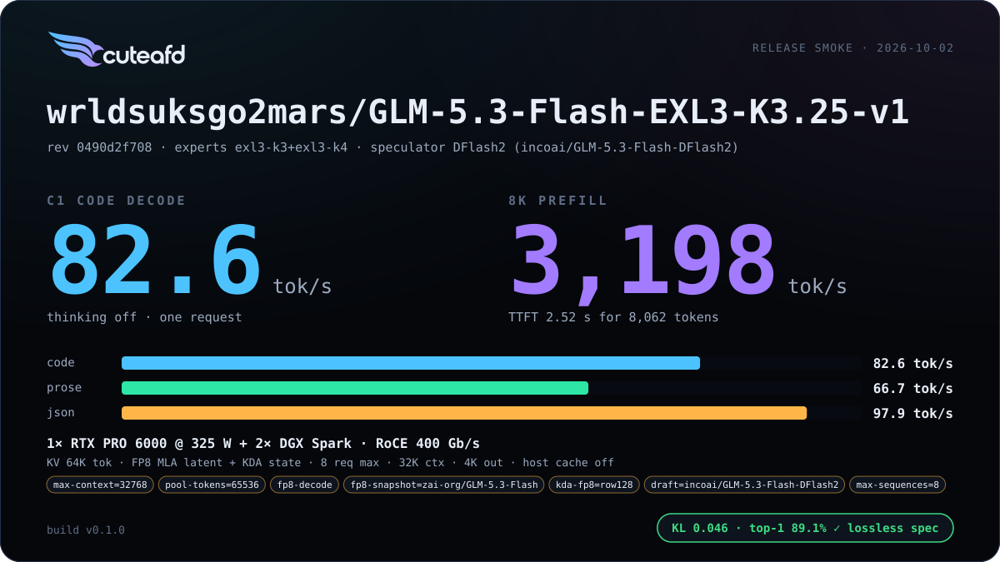
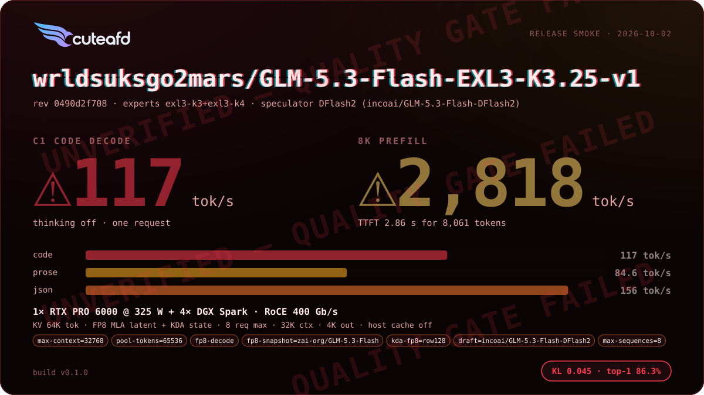
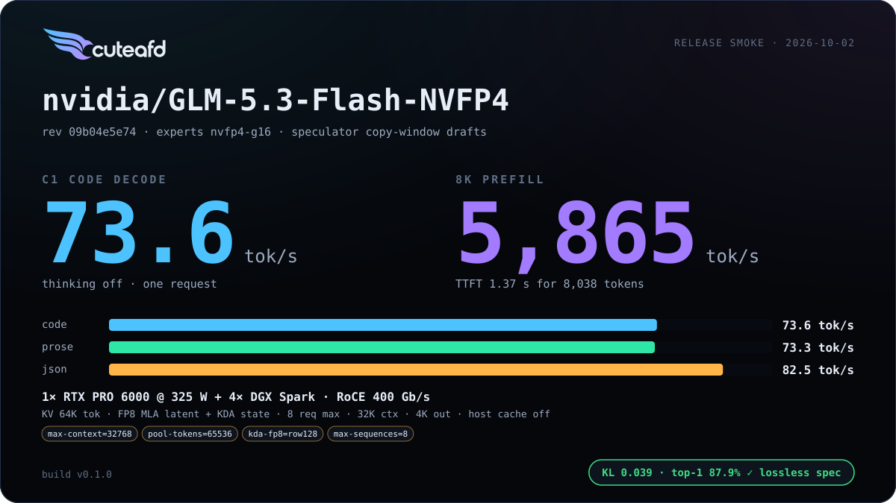
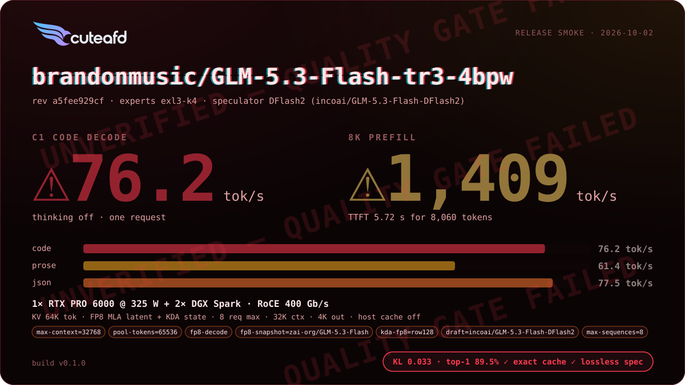
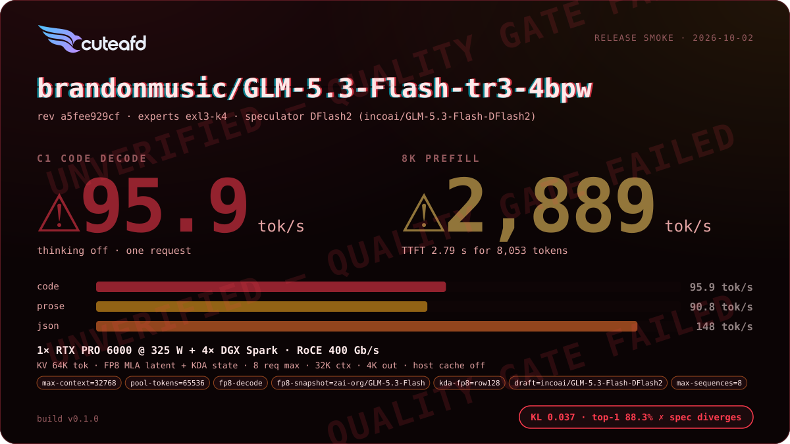

# GLM 5.3 Flash

A hybrid-attention sibling of GLM 5.3: most layers run linear Kimi Delta
Attention (KDA), a minority run MLA + DSA.

## Supported checkpoints / quants

- `zai-org/GLM-5.3-Flash` official FP8.
- `brandonmusic/GLM-5.3-Flash-tr3-4bpw` and other standard exllamav3 EXL3
  tr3 publications — read directly from `config.json` + tensor headers, no
  CuteAFD-specific side files required.
- NVIDIA ModelOpt NVFP4 (`nvidia/GLM-5.3-Flash-NVFP4`) — routed experts and
  dense MLPs both run natively in NVFP4.

## Engineering summary

- Attention: hybrid — Kimi Delta Attention (token-sequential linear
  recurrence) on most layers, MLA + DSA (no RoPE, pooled indexer with
  gated-softmax pool keys) on the rest.
- mHC hyper-connections, collapsing with an unweighted mean (GLM 5.3 uses a
  learned `hc_head` instead).
- Routed experts: top-8 of 288 sigmoid experts with a SwiGLU clamp of 10;
  FP8 128x128 blocks, EXL3 K3/K4, or ModelOpt NVFP4 group-16. GLM 5.3 Flash
  is the only GLM family with a local (RTX-resident, TP1) expert path.
- Speculator: the native MTP layer is not run — DFlash2 external drafters
  verify copy-window drafts, with KDA state backed up and replayed per
  verify step (there is no free rollback for recurrent state).
- Dense NVFP4 MLPs run natively on a ModelOpt release; its per-tensor FP8
  dense MLPs prefill as static W8A8 on their own scales; BF16 attention,
  indexer and shared experts quantize to FP8 blocks at load by default
  (`CUTEAFD_GLM_BF16=native` keeps them BF16 at a coordinator-step cost).
- KV format: FP8 MLA latent record on the MLA+DSA layers; a recurrent FP32
  state per KDA layer plus short-convolution state.
- RTX/Spark layouts: scales from 1 RTX with local experts up through
  multi-Spark TP for the full checkpoint; head split is not this family's
  default today (DFlash2 and KDA state rollback dominate the latency
  budget).
- Prefix cache: merged — 256-row units (4 MLA pages plus the pool page) and
  a KDA recurrent-state mark at the commit point (`kda_len`).

## Default precision (single residency)

Every weight has one resident format. Precision is chosen by measurement:
FP8 converts at load into the only copy where it is faster and the golden
stays within ~0.005 nat KL/NLL; drafters run FP8 whenever emitted tok/s is
higher (they cannot change the output). Measured 2026-10-03, natural minimum,
one warm launch per arm, `CONCURRENCY=4`, code tok/s (C4 aggregate), golden
512 tokens.

| Arm | C1 | C4 | 8K prefill | KL · top-1 · NLL |
| --- | ---: | ---: | ---: | --- |
| checkpoint (BF16 KDA, head, drafter) | 72.3 | 113.8 | 2,319 | 0.046 · 89.1% · 3.481 |
| FP8 drafter | 77.1 | 118.3 | 2,666 | 0.046 · 89.1% · 3.481 |
| FP8 KDA row128 + drafter | 69.9 | 113.5 | 4,764 | 0.043 · 86.9% · 3.474 |
| FP8 head + drafter | 70.4 | 121.6 | 2,972 | 0.047 · 87.9% · 3.476 |
| **FP8 KDA row128 + head + drafter (default)** | 77.6 | 131.8 | 2,191 | 0.044 · 85.7% · 3.470 |

GLM 5.3 Flash EXL3 K3.25, 1 RTX + 2 Sparks. KL and NLL improve; top-1 drops 3.4 points (near-tie flips). KDA 13.14 GiB dual → 4.43 GiB, head 1.79 → 0.61 GiB. `GLM5_FLASH_KDA_FP8=off`, `GLM5_FLASH_FP8_HEAD=off`, `SPECULATOR_FP8=off` keep BF16.

## Known limits

- Running BF16 attention natively (`CUTEAFD_GLM_BF16=native`) costs a
  meaningful coordinator-step slowdown versus the default FP8-block path;
  use it only when the extra precision is worth it.

## Changelog

| Version | Date | Change | Basic eval |
| --- | --- | --- | --- |
| v0 | 2026-10-02 | First release |      |

## Additional benchmarks

| Engine version | Date | Profile | Hardware | Report |
| --- | --- | --- | --- | --- |

_No additional benchmark reports yet._
