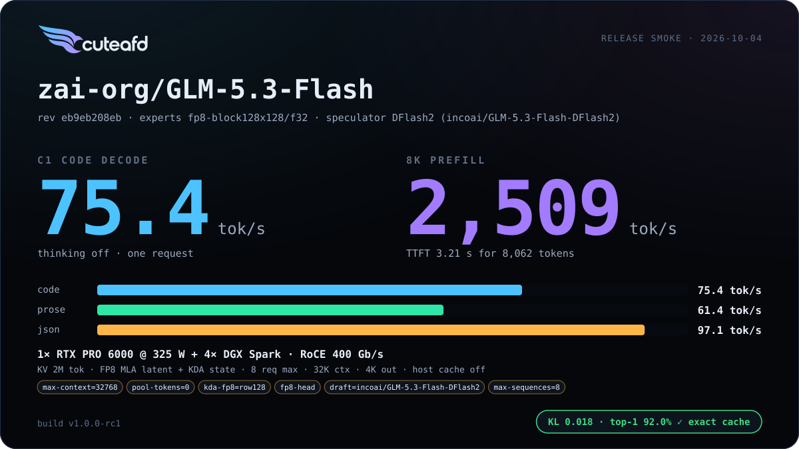
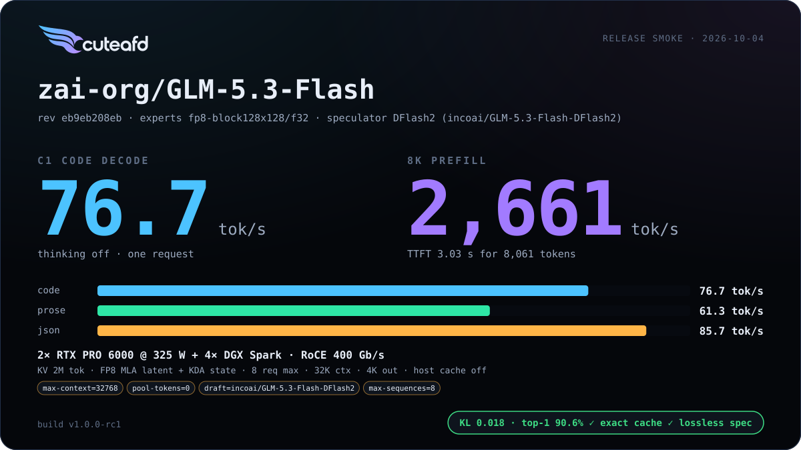
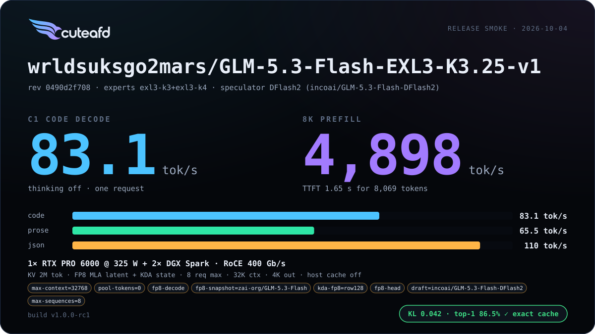
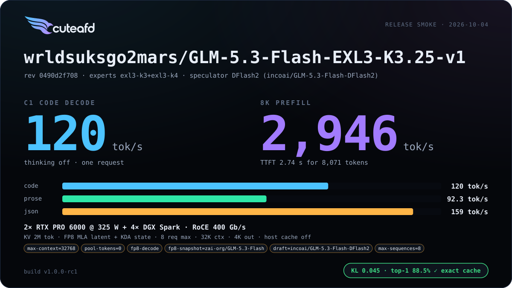
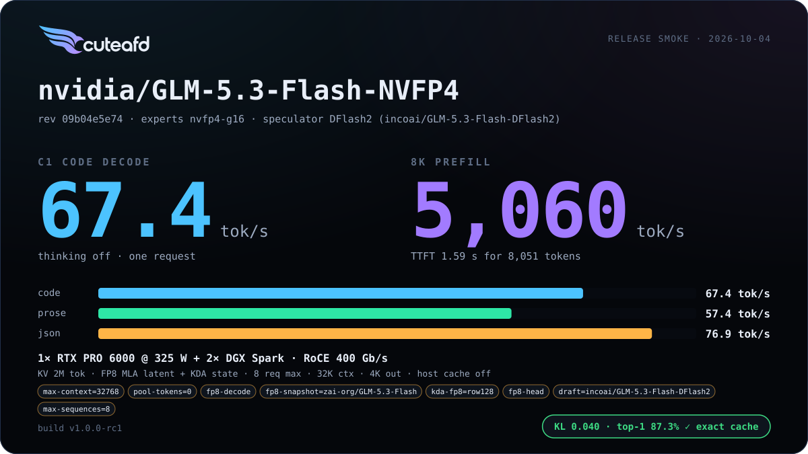
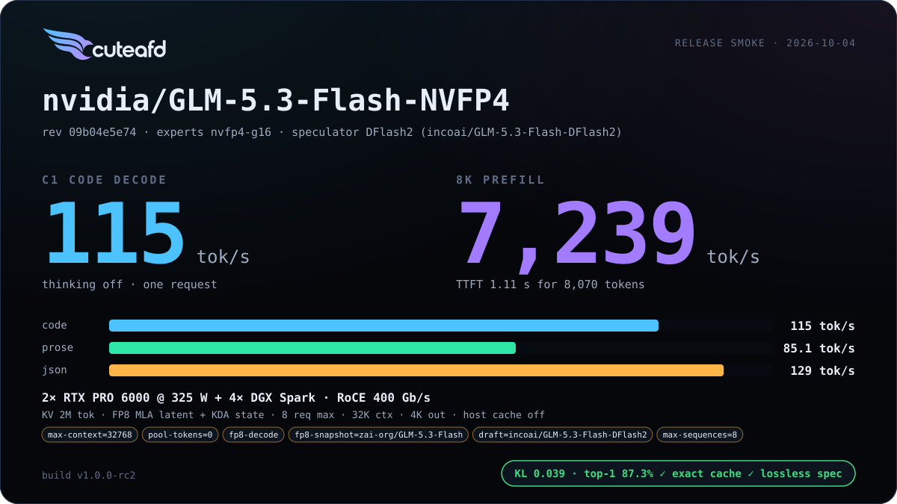
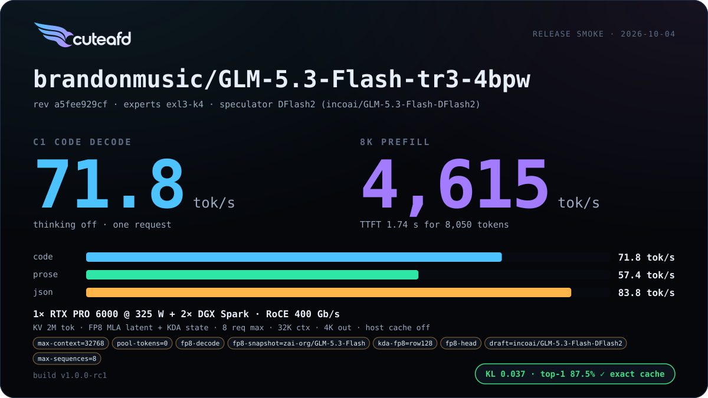
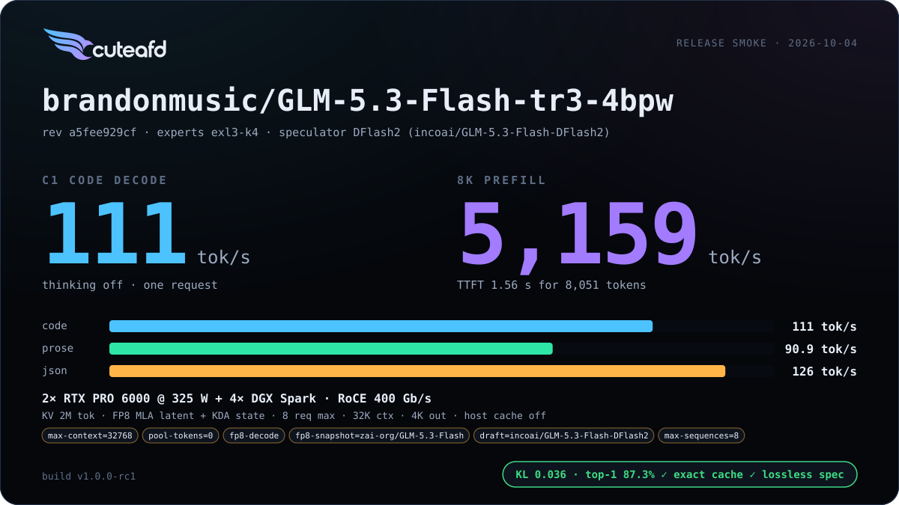

# GLM 5.3 Flash

A hybrid-attention sibling of GLM 5.3: most layers run linear Kimi Delta
Attention (KDA), a minority run MLA + DSA.

## Supported checkpoints / quants

- `zai-org/GLM-5.3-Flash` official FP8.
- `brandonmusic/GLM-5.3-Flash-tr3-4bpw` and other standard exllamav3 EXL3
  tr3 publications — read directly from `config.json` + tensor headers, no
  CuteAFD-specific side files required.
- NVIDIA ModelOpt NVFP4 (`nvidia/GLM-5.3-Flash-NVFP4`) — routed experts and
  dense MLPs both run natively in NVFP4.

## Engineering summary

- Attention: hybrid — Kimi Delta Attention (token-sequential linear
  recurrence) on most layers, MLA + DSA (no RoPE, pooled indexer with
  gated-softmax pool keys) on the rest.
- mHC hyper-connections, collapsing with an unweighted mean (GLM 5.3 uses a
  learned `hc_head` instead).
- Routed experts: top-8 of 288 sigmoid experts with a SwiGLU clamp of 10;
  FP8 128x128 blocks, EXL3 K3/K4, or ModelOpt NVFP4 group-16. GLM 5.3 Flash
  is the only GLM family with a local (RTX-resident, TP1) expert path.
- Speculator: the native MTP layer is not run. External drafters: DFlash2
  (incoai/GLM-5.3-Flash-DFlash2, the default for every checkpoint) or the
  RedHat dSpark (`SPECULATOR=dspark`, RedHatAI/GLM-5.3-Flash-speculator.dspark-preview:
  eight drafts per block, Markov and confidence heads); KDA state is backed
  up and replayed per verify step (there is no free rollback for recurrent
  state). DFlash2 vs dSpark, emitted tok/s, C1 / C4 code / agentic C1:

  | checkpoint | layout | DFlash2 | dSpark | no drafter |
  | --- | --- | --- | --- | --- |
  | EXL3 K3.25 | 1 RTX + 2 Sparks | 110.8 / 292 / 100.1 | 101.8 / 275 / 76.6 | 60.7 / 192 / 63.4 |
  | EXL3 K3.25 | 2 RTX + 4 Sparks | 167.4 / 322 / 153.7 | 146.8 / 346 / 100.3 | 82.0 / 287 / 85.9 |
  | NVIDIA NVFP4 | 1 RTX + 2 Sparks | 87.3 / 231 / 77.7 | 69.1 / 190 / 57.4 | 52.8 / 200 / 54.4 |
  | NVIDIA NVFP4 | 2 RTX + 4 Sparks | 117.3 / 415 / 131.1 | 118.2 / 347 / 91.3 | 74.8 / 232 / 79.1 |
  | tr3 4bpw | 1 RTX + 2 Sparks | 99.0 / 212 / 86.8 | 71.4 / 269 / 65.2 | 56.1 / 173 / 58.1 |
  | tr3 4bpw | 2 RTX + 4 Sparks | 149.6 / 435 / 131.0 | 132.0 / 407 / 87.2 | 78.3 / 280 / 81.5 |
- Dense NVFP4 MLPs run natively on a ModelOpt release; its per-tensor FP8
  dense MLPs prefill as static W8A8 on their own scales; BF16 attention,
  indexer and shared experts quantize to FP8 blocks at load by default
  (`CUTEAFD_GLM_BF16=native` keeps them BF16 at a coordinator-step cost).
- KV format: FP8 MLA latent record on the MLA+DSA layers; a recurrent FP32
  state per KDA layer plus short-convolution state.
- RTX/Spark layouts: scales from 1 RTX with local experts up through
  multi-Spark TP for the full checkpoint. `RTX_GPUS=auto/2` selects the
  two-GPU head split when both coordinator GPUs are available;
  `RTX_GPUS=1` or `COORDINATOR_SPLIT=off` serves from one GPU.
- Prefix cache: merged — 256-row units (4 MLA pages plus the pool page) and
  a KDA recurrent-state mark at the commit point (`kda_len`).

## Default precision (single residency)

Every weight has one resident format. The launcher resolves precision after
it chooses the serving layout: with one coordinator GPU,
`GLM5_FLASH_KDA_FP8=auto` (including unset) selects `row128` and
`GLM5_FLASH_FP8_HEAD=auto` selects `on`; with the two-GPU head split they
select `off` (BF16 KDA and head). Explicit `off/row128/channel` KDA and
`on/off` head settings always win, including the deprecated `GLMF_*` keys;
current names take precedence over deprecated names. The DFlash2 drafter
defaults to FP8 on both layouts; `SPECULATOR_FP8=off` keeps it BF16.

Matched recheck, 2026-10-04: GLM 5.3 Flash EXL3 K3.25, RTX PRO 6000 at
325 W, fixed code prompts/nonces, one warm batch per concurrency, 512
identical teacher-forced golden positions (reference NLL 3.45433). D uses
BF16 KDA/head + FP8 drafter; F uses FP8 row128 KDA/head/drafter. Rates are
emitted tok/s; C4 is aggregate. Agentic timing replays one common four-turn
reasoning-enabled history and reports median per-turn decode rate.

1 RTX + 2 Sparks, medians of three interleaved launches per arm:

| Arm | C1 | C4 | 8K prefill | Agentic | Top-1 | KL | NLL |
| --- | ---: | ---: | ---: | ---: | ---: | ---: | ---: |
| D | 101.9 | 159.4 | 5,141 | 127.6 | 87.11% | 0.04288 | 3.47328 |
| **F (default)** | **111.1** | **172.4** | **5,137** | **132.6** | 86.52% | 0.04231 | 3.46966 |

F gains 9.0% C1, 8.2% C4 and 3.9% agentic decode, with 0.59 points less
top-1 and better KL/NLL. Readiness medians were 41 → 43 s (worker and
container startup included).

2 RTX + 4 Sparks, head split, one warm launch per arm:

| Arm | C1 | C4 | 8K prefill | Agentic | Top-1 | KL | NLL |
| --- | ---: | ---: | ---: | ---: | ---: | ---: | ---: |
| **D (default)** | **157.6** | **283.2** | **6,767** | **202.0** | 88.48% | 0.04508 | 3.47410 |
| F (opt-in) | 172.1 | 255.7 | 5,113 | 209.4 | 86.91% | 0.04780 | 3.47082 |

F gains 9.2% C1 but loses 9.7% C4 and 24.4% prefill, loses 1.56 top-1
points and worsens KL. It fails the promotion bar under the head split.
Readiness was 53 → 50 s. Both arms/layouts pass fidelity and exact
prefix-cache restores; the speculation check permits verify rounding and
does not establish byte-identical speculative output. See the
[full comparison and conditions](../../benchmarks/glm5_flash/2026-10-04-fp8-recheck/comparison.json).

## Known limits

- NVFP4 defaults to the official FP8 companion for block projections.
  `GLM5_FLASH_FP8_MODEL_ID=off` now also works with the two-GPU split:
  BF16 projections are packed exactly as in the unsplit path before
  slicing. Native NVFP4 dense and routed experts are unchanged.
- Running BF16 attention natively (`CUTEAFD_GLM_BF16=native`) costs a
  meaningful coordinator-step slowdown versus the default FP8-block path;
  use it only when the extra precision is worth it.
- FP8 KDA/head under the two-GPU head split misses the C4, prefill and
  top-1/KL promotion bars. BF16 KDA/head stays the split default; explicit
  FP8 remains opt-in. The Spark-wait and split-rounding contributions need
  a matched follow-up before any promotion.
- Prefill timing is sensitive to the exact smoke prompt, including its
  random nonce. Release comparisons use a separate fixed-prompt probe;
  historical single-card throughput alone does not establish a regression.
- Speculative verify is not byte-identical to plain decode, and C1/C4
  greedy outputs can differ. Prefix-cache restores and rejected-suffix
  causality pass; batch-invariant prefill and verify are deferred.
- One-RTX NVFP4 local experts must fit resident weight and serving
  reservations. Implicit expert paging was removed; `--expert-window` is
  an explicit fallback with a substantial latency cost.
- NVFP4 decode/verify uses W4A16; native W4A4 for these small-row shapes is
  deferred.

## Changelog

| Version | Date | Change | Basic eval |
| --- | --- | --- | --- |
| v1 | 2026-10-04 | Two-RTX head split and DFlash2 for all quants; single-copy FP8 drafter; FP8 KDA/head on one GPU and BF16 under the split; stop-token grammar completion; resident local NVFP4 experts; corrected NVFP4 split loading without a companion and complete-chunk prefill warm-up. |         |
| v0 | 2026-10-02 | First release |      |

## Additional benchmarks

| Engine version | Date | Profile | Hardware | Report |
| --- | --- | --- | --- | --- |

_No additional benchmark reports yet._
