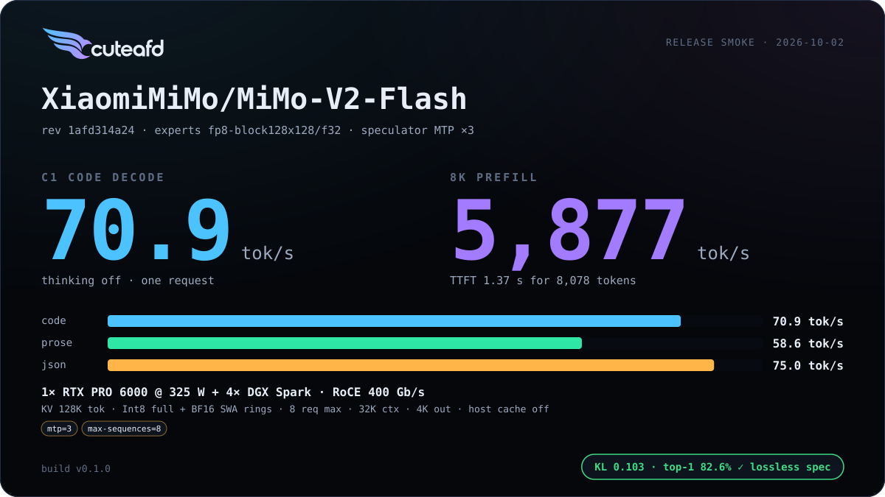
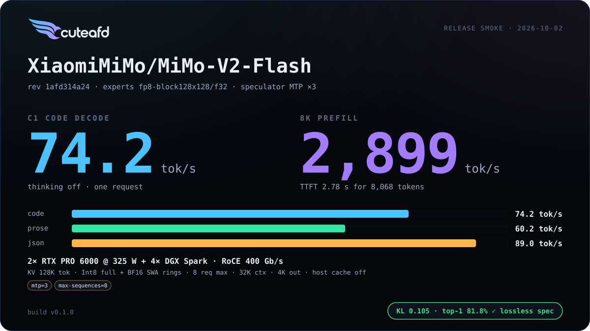
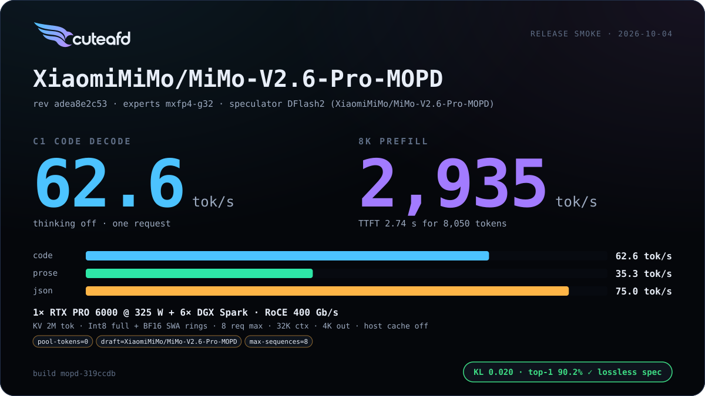
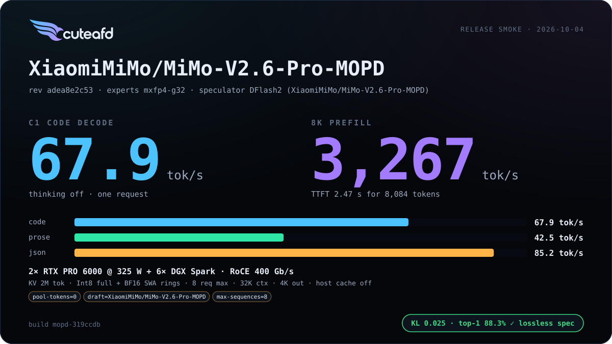

# MiMo V2 (Flash / V2.6 Pro)

Hybrid full / sliding-window GQA attention with learned sinks, sigmoid top-8
experts without a shared expert.

## Supported checkpoints / quants

- `XiaomiMiMo/MiMo-V2-Flash` — FP8 128x128-block routed experts
  (`mimo:fp8`).
- `XiaomiMiMo/MiMo-V2.6-Pro-MOPD` — native MXFP4 routed experts
  (`mimop:fp8`, E2M1 + UE8M0 per 32). Supersedes `MiMo-V2.6-Pro-RL`
  (same architecture, config, tokenizer and tensor layout; Xiaomi's MOPD2
  pass fixes the RL release's tool-call repetition). RL still loads.

## Engineering summary

- Attention: GQA full attention on some layers, 128-token sliding-window
  GQA with a learned per-layer sink bias on the rest; sinks are taken on SWA
  layers only. NeoX RoPE on a partial head width; int8 full-attention KV
  (FP32 scale per 32 dims) in paged pools, BF16 SWA rings.
- No shared expert; sigmoid noaux_tc router with `e_score_correction_bias`
  (FP32 weight on V2 Flash, BF16 on V2.6 Pro).
- Routed experts: V2 Flash runs `mimo:fp8` (E4M3 + FP32 128x128 scales,
  Spark TP2/TP4/TP6, coordinator TP1 local); V2.6 Pro runs `mimop:fp8`
  (MXFP4, Spark TP2/TP6, coordinator TP1 local).
- Speculator: native MTP layers (SWA attention, dense FFN, `eh_proj`
  fusion) or a DFlash external drafter — DFlash is the measured-best
  speculator for V2.6 Pro.
- V2.6 Pro's `qkv_proj` ships fused and TP-interleaved per checkpoint shard
  with its own per-shard FP8 scale grid; the loader de-interleaves it.
- RTX/Spark layouts: head split (KV partitioned, one hidden all-reduce per
  layer) is the default on 2 RTX for both members of this family — the
  first family where splitting attention across two GPUs measured as a
  clear win, since its o_proj and attention weights are unusually large
  next to the dense path.
- Prefix cache: merged for both V2 Flash and V2.6 Pro.

## Default precision (single residency)

Every weight has one resident format. Precision is chosen by measurement:
FP8 converts at load into the only copy where it is faster and the golden
stays within ~0.005 nat KL/NLL; drafters run FP8 whenever emitted tok/s is
higher (they cannot change the output). Measured 2026-10-03, natural minimum,
one warm launch per arm, `CONCURRENCY=4`, code tok/s (C4 aggregate), golden
512 tokens.

| Arm | C1 | C4 | 8K prefill | KL · top-1 · NLL |
| --- | ---: | ---: | ---: | --- |
| V2 Flash checkpoint | 69.4 | 108.5 | 5,864 | 0.103 · 82.6% · 4.313 |
| **V2 Flash FP8 head + o_proj (default)** | 72.6 | 125.1 | 5,548 | 0.092 · 83.2% · 4.308 |
| V2.6 Pro checkpoint | 55.1 | 71.5 | 2,352 | 0.026 · 86.7% · 3.379 |
| **V2.6 Pro FP8 head + o_proj + DFlash (default)** | 58.0 | 87.3 | 2,656 | 0.028 · 86.5% · 3.368 |

MiMo V2 Flash 1 RTX + 4 Sparks; V2.6 Pro 1 RTX + 6 Sparks. Coordinator VRAM: V2 Flash 16.4 → 14.2 GB; V2.6 Pro 46.0 → 36.4 GB (v0 dual copy 59.9 GB). `MIMO_WEIGHT_POLICY=checkpoint` keeps source formats; `MIMO_FP8_HEAD`/`MIMO_FP8_O_PROJ`/`SPECULATOR_FP8` override.

## Known limits

- V2.6 Pro's prefill is intake-bound on the Spark-to-coordinator exchange of
  partial rows at larger TP; Spark-side reduction of partials is a parked
  experiment (small gain, bandwidth-bound either way).
- V2.6 Pro's native checkpoint needs all six Sparks to fit its MXFP4 expert
  footprint; V2 Flash fits a smaller pool.
- V2 Flash's maximum layout still prefills more slowly than its natural
  minimum after the two-lane improvement; head-split overhead remains open.
- V2 Flash fidelity is near the smoke threshold (KL about 0.10, top-1 about
  82%). BF16 expert-input Spark packages are opt-in (`EXPERT_INPUT=bf16`)
  and must be included in the image before use.
- Exact Spark slices remove zero padding, but MXFP4 32-row down-projection
  tails remain a follow-up; larger padded slices can still cost memory and
  expert-wave time.
- Batch-invariant prefill and verify are deferred; a speculation-lossless
  smoke result permits proven numerical rounding, not a state mismatch.

## Changelog

| Version | Date | Change | Basic eval |
| --- | --- | --- | --- |
| v1 | 2026-10-04 | V2.6 Pro MOPD checkpoint and DFlash; native A8 MXFP4 down projection and exact Spark slices; single-copy FP8 head/O/drafter; pipelined head-split prefill; Flash two-lane default. | Pending v1.0.0-rc1 Release smoke; cards populated by `cuteafd bench publish`. |
| v0 | 2026-10-02 | First release |   |
| v0-mopd | 2026-10-04 | Model-affecting: V2.6 Pro checkpoint `MiMo-V2.6-Pro-RL` → `MiMo-V2.6-Pro-MOPD` (Xiaomi's MOPD2 pass over the RL weights fixes tool-call repetition; architecture, config, tokenizer, chat template and tensor layout unchanged, DFlash drafter retrained). Golden and bench fidelity reference regenerated from MOPD. |   |

## Additional benchmarks

| Engine version | Date | Profile | Hardware | Report |
| --- | --- | --- | --- | --- |

_No additional benchmark reports yet._
