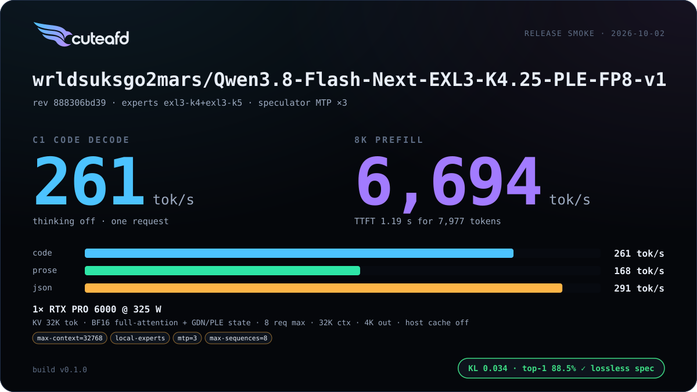
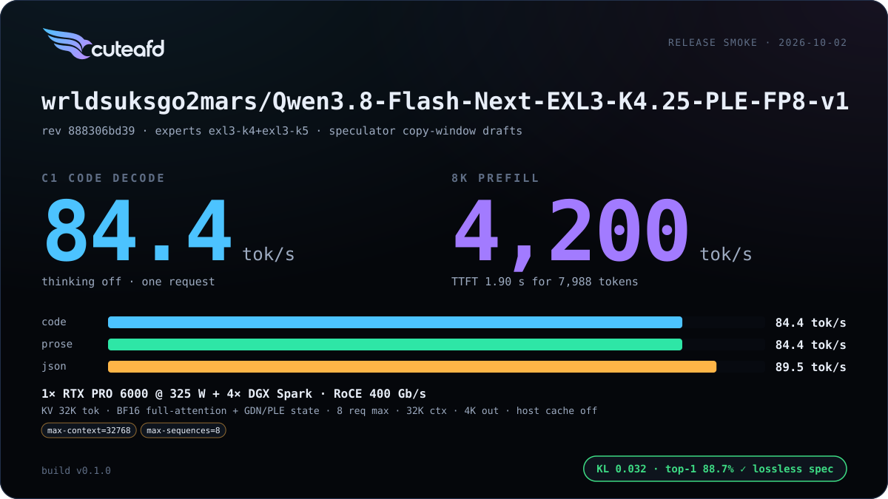
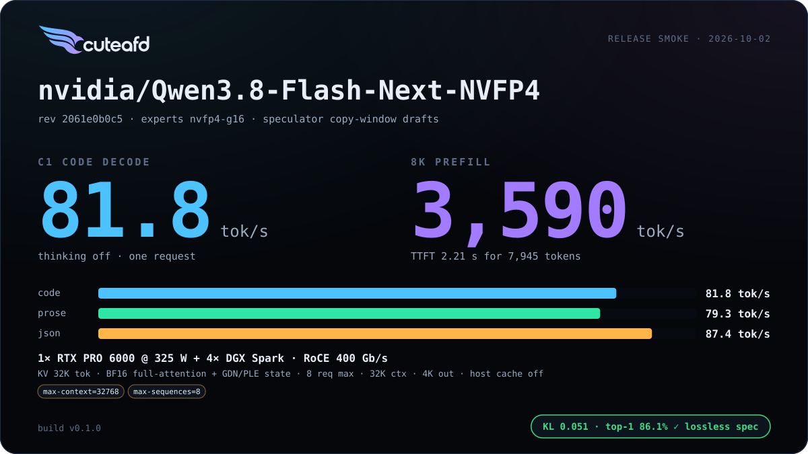

# Qwen 3.8 Flash Next

`qwen4_exp`: Gated DeltaNet (GDN) linear attention with a full-attention
layer every fourth, a PLE n-gram memory table, and fused expert tensors.

## Supported checkpoints / quants

- `Qwen/Qwen3.8-Flash-Next` official release — FP8 128x128-block routed
  experts (`qwen4:fp8`).
- EXL3 K4.25 PLE publications of the same checkpoint (`qwen4:exl3-k45`).
- NVIDIA ModelOpt NVFP4 — routed experts run W4A16 (`qwen4:nvfp4`).

## Engineering summary

- Attention: Gated DeltaNet linear recurrence on most layers, full GQA with
  an indexer every fourth layer.
- Shared expert with a sigmoid gate; hyper-connections (low-rank) mix the
  residual stream alongside the router.
- PLE n-gram memory table: a mapped table gathering 16 rows of 160 per token
  from pinned host RAM (or GPU), with bounded prefetch.
- Routed experts: 512 experts, top-10, hidden 2560 / intermediate 640, SiLU
  unclamped, stored as one fused `[experts, ...]` tensor per projection per
  layer; EXL3 K4/K5, FP8 128x128 blocks, or ModelOpt NVFP4 group-16; a local
  (RTX-resident, TP1) expert path is supported.
- Speculator: native MTP (full attention, 512 experts, and a hyper-connection
  feedback path). The launcher defaults to MTP3 with resident local EXL3
  experts; `SPECULATOR=off` disables it and `SPECULATOR_DEPTH` overrides the
  depth. The policy adapts the number of drafts to concurrency and acceptance.
- RTX/Spark layouts: qualified EXL3 fits on one RTX with resident local
  experts; the official FP8 expert package (~173 GB) does not fit one RTX.
  Spark EXL3 supports TP4 using uneven
  intermediate slices for the 640-wide experts.
- Prefix cache: merged — 256-row units over the full-attention layers, a
  combined GDN-state + PLE mark, with n-gram history recomputed from token
  ids rather than cached.

## Default precision (single residency)

Every weight has one resident format. Precision is chosen by measurement:
FP8 converts at load into the only copy where it is faster and the golden
stays within ~0.005 nat KL/NLL; drafters run FP8 when delivered tok/s is
higher and the speculation-lossless gate passes. Measured 2026-10-03,
natural minimum, one warm launch per arm, `CONCURRENCY=4`, code tok/s
(C4 aggregate), golden 512 tokens.

| Arm | C1 | C4 | 8K prefill | KL · top-1 · NLL |
| --- | ---: | ---: | ---: | --- |
| checkpoint (BF16 projections, head) | 196 | 439 | 6,146 | 0.034 · 88.5% · 3.297 |
| **FP8 head (default)** | 222 | 441 | 6,100 | 0.036 · 88.5% · 3.300 |
| FP8 head + FP8 GDN/attention projections | 247 | 489 | 6,177 | 0.046 · 86.7% · 3.360 |

Qwen 3.8 Flash Next EXL3 K4.25, 1 RTX, MTP 3. FP8 projections fail the KL gate (+0.012) and stay opt-in (`QWEN_FP8_DECODE=on`); `QWEN_FP8_HEAD=off` keeps BF16. The target and MTP share the same head; enabling MTP adds no second vocabulary-head copy.

## Default speculation and placement

`EXPERT_BACKEND=auto` prefers resident local EXL3 experts when the planner
admits the weights, MTP, serving reservations and requested KV pool. After
local admission, an unset `SPECULATOR` selects native MTP at depth 3. Explicit
`EXPERT_BACKEND=local` uses the same speculation default. `MTP=0` retains the
legacy opt-out; explicit depth settings retain their meaning.

The default is selected by delivered C1/C4 code and reasoning-on agentic
tok/s, with C16 and 8K prefill measured alongside. Native MTP also prefills
its own attention state. Release smoke uses
the current speculation-lossless rule: a greedy flip is informational when
plain decode repeats every token and row exactly and verify rows already
differed before the flip. A sudden state change still fails. Golden NLL and
prefix-cache restore checks must pass.

## Known limits

- FP8 experts have no Spark TP layout yet: 640 is not evenly divisible the
  way the FP8 MoE kernel currently tiles larger TP degrees. Spark supports
  EXL3 and NVFP4; the official FP8 checkpoint is outside the v1 smoke matrix.
- Spark workers serve backbone expert layers only; `mtp.layers.0.mlp.experts`
  has no Spark execution path. `EXPERT_BACKEND=spark` (or an automatic Spark
  fallback) keeps native MTP off, and explicit `SPECULATOR=mtp` reports the
  missing expert layer before launching. Whether MTP wins with Sparks remains
  unmeasured until that layer is supported.
- The automatic MTP default is qualified for local EXL3. Other expert formats
  retain explicit speculation settings.
- Local MTP verify and plain decode can differ at low-margin greedy
  positions, and C1/C4 outputs can differ. The current gate accepts proven
  verify rounding; byte-identical speculation and batch invariance are open.
- There is no two-GPU coordinator head split; a two-RTX request serves from
  the first GPU. Spark expert placement is slower than qualified local EXL3
  at the reference configurations.
- One-RTX NVFP4 local experts must fit resident weight and serving
  reservations. Implicit paging was removed; `--expert-window` explicitly
  enables the slower paging fallback. The local automatic MTP default is
  qualified for EXL3, not NVFP4.
- NVFP4 decode/verify uses W4A16; native W4A4 for these small-row shapes is
  deferred.

## Changelog

| Version | Date | Change | Basic eval |
| --- | --- | --- | --- |
| v1 | 2026-10-04 | Automatic resident local EXL3 placement and native MTP3 with a shared FP8 head; memory admission; resident local NVFP4 experts with explicit paging fallback. | Pending v1.0.0-rc1 Release smoke; cards populated by `cuteafd bench publish`. |
| v0 | 2026-10-02 | First release |    |

## Additional benchmarks

| Engine version | Date | Profile | Hardware | Report |
| --- | --- | --- | --- | --- |

_No additional benchmark reports yet._
